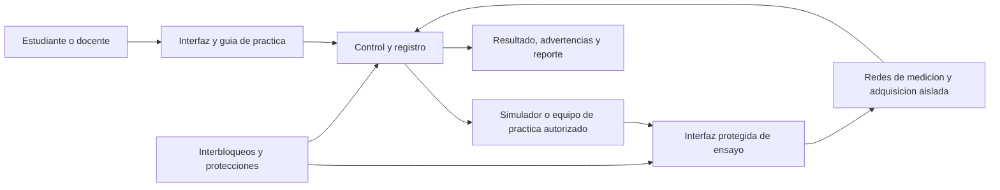

# Base de investigacion y proceso de diseno

## Proyecto propuesto

**Titulo de trabajo.** Diseno de un prototipo de analizador de seguridad electrica de arquitectura abierta para el aprendizaje practico de pruebas de seguridad electrica en equipos electromedicos, con referencia a IEC 60601-1 e IEC 62353.

**Delimitacion indispensable.** El resultado es un prototipo didactico para laboratorio, no un producto sanitario ni un instrumento certificado para liberar equipos clinicos al servicio. Sus resultados no deben utilizarse para declarar conformidad normativa, diagnosticar equipos conectados a pacientes ni tomar decisiones clinicas. Todo ensayo debe realizarse sin paciente conectado, bajo supervision docente y con un protocolo de seguridad.

Esta delimitacion permite un proyecto realizable y eticamente defendible: se aprende el principio, la secuencia de ensayo y la interpretacion de resultados, sin afirmar una certificacion que exige ensayos, trazabilidad metrologica y evaluacion formal fuera del alcance de un prototipo academico.

## Documentos de la fase de investigacion

1. [Indagacion social](INDAGACION%20SOCIAL/indagacion%20social.md)
2. [Instrumentos de indagacion](INDAGACION%20SOCIAL/Instrumentos%20de%20indagacion.md)
3. [Necesidades identificadas](NECESIDADES%20DEL%20OBJETIVO/necesidades%20identificadas.md)
4. [Arbol de objetivos](NECESIDADES%20DEL%20OBJETIVO/Arbol%20de%20objetivos.md)
5. [Marco teorico](REFERENTES%20CONCEPTUALES%20Y%20CONTEXTUALES/Marco%20teorico.md)
6. [Estado del arte](REFERENTES%20CONCEPTUALES%20Y%20CONTEXTUALES/Estado%20del%20arte.md)
7. [Bibliografia consolidada](REFERENTES%20CONCEPTUALES%20Y%20CONTEXTUALES/Bibliografia%20consolidada.md)

## 1. Introduccion

### 1.1 Descripcion y formulacion del problema

Los equipos electromedicos emplean energia electrica y, segun su funcion, pueden tener partes aplicadas al paciente. Por ello, su seguridad electrica es relevante para pacientes, operadores y personal tecnico. IEC 60601-1 establece requisitos generales de seguridad basica y desempeno esencial para equipo electromedico; IEC 62353 aborda pruebas de seguridad previas a la puesta en servicio, durante mantenimiento, despues de reparacion y recurrentes (International Electrotechnical Commission [IEC], 2020, 2014).

La formacion practica para estas pruebas suele depender de analizadores comerciales. Aunque estos instrumentos son apropiados para uso profesional, su costo, arquitectura cerrada y automatizacion reducen la posibilidad de que el estudiante observe, modifique y relacione cada bloque de medicion con el fenomeno electrico que representa. Como consecuencia, puede existir una brecha entre conocer los nombres de las pruebas y comprender su principio de medicion, las condiciones de ensayo, los limites aplicables y la interpretacion responsable del resultado.

El problema de diseno se formula asi:

> ¿Como disenar un prototipo de analizador de seguridad electrica, de arquitectura abierta y uso didactico, que permita a estudiantes practicar de manera segura y trazable pruebas seleccionadas de seguridad electrica en equipos electromedicos, tomando como referencia IEC 60601-1 e IEC 62353?

**Causas por verificar con la indagacion.**

1. Disponibilidad limitada de equipos de demostracion o de horas de practica.
2. Baja visibilidad de la arquitectura interna y del flujo de medicion de los analizadores comerciales.
3. Necesidad de integrar teoria normativa, riesgo electrico y practica instrumental.
4. Falta de guias de aprendizaje que conecten configuracion, prueba, resultado y criterio de aceptacion.

**Efectos esperados si el problema persiste.**

1. Aprendizaje predominantemente procedimental o memoristico.
2. Dificultad para identificar errores de conexion, condiciones de prueba y limitaciones de una medicion.
3. Menor preparacion para actividades de mantenimiento y gestion de tecnologia biomedica.

**Variables de contexto que deben documentarse, no suponerse.** Numero de cursos y estudiantes potenciales, equipos disponibles, horas de laboratorio, pruebas que se ensenan actualmente, incidentes o dificultades reportadas, presupuesto estimado y requisitos de seguridad del laboratorio. Estos datos deben provenir de entrevistas, encuestas, inventario institucional y reglamentos del laboratorio.

### 1.2 Objetivos

**Objetivo general**

Disenar un prototipo de analizador de seguridad electrica de arquitectura abierta para apoyar el aprendizaje practico de pruebas seleccionadas en equipos electromedicos, con referencia a IEC 60601-1 e IEC 62353.

**Objetivos especificos**

1. Caracterizar las necesidades, conocimientos previos y condiciones de uso de estudiantes, docentes y personal tecnico mediante entrevistas, encuesta e inventario del entorno de practica.
2. Establecer los requisitos funcionales, de seguridad, usabilidad y trazabilidad del prototipo a partir de la indagacion, la revision documental y el analisis de soluciones existentes.
3. Generar y seleccionar una arquitectura abierta que permita demostrar de forma segura las funciones de medicion escogidas y registrar los resultados de practica.
4. Construir y evaluar un prototipo didactico contra los requisitos priorizados, empleando cargas o simuladores seguros y un protocolo de pruebas.

### 1.3 Justificacion

El proyecto aporta una herramienta de aprendizaje que hace visible la relacion entre seguridad electrica, arquitectura de medicion y procedimiento de prueba. Su valor no esta en reemplazar un analizador certificado, sino en permitir que el estudiante inspeccione sus bloques funcionales, configure escenarios controlados y contraste resultados con un procedimiento documentado.

En el plano academico, el prototipo integra electronica, instrumentacion, gestion del riesgo y normativa de equipos electromedicos. En el plano practico, puede reducir la dependencia de una unica interfaz cerrada para explicar conceptos como continuidad del conductor de proteccion, aislamiento y corrientes de fuga. En el plano economico, una arquitectura modular y documentada favorece el mantenimiento, la replicabilidad y el uso escalonado de recursos de laboratorio; estos beneficios deberan cuantificarse con cotizaciones reales y no declararse sin evidencia.

### 1.4 Antecedentes y estado del arte

El antecedente normativo principal es IEC 60601-1, que define requisitos generales de seguridad basica y desempeno esencial para equipos electromedicos. IEC 62353 se centra en las pruebas recurrentes, de mantenimiento y posteriores a reparacion de esos equipos. Por tanto, no son documentos intercambiables: la primera se orienta a la seguridad del equipo y la segunda a actividades de verificacion en servicio (IEC, 2020, 2014).

Los analizadores comerciales de seguridad electrica integran, con distintos niveles de automatizacion, pruebas como continuidad de tierra de proteccion, aislamiento y corrientes de fuga. Su estudio debe realizarse a partir de manuales tecnicos vigentes, no solo de material publicitario. Para cada producto se registraran las pruebas disponibles, rangos, incertidumbre o exactitud declarada, interfaces, accesorios, protecciones, trazabilidad, costo y uso previsto. Referentes iniciales: Fluke Biomedical ESA 615, Rigel 288+ y Pronk Safe-T Sim. Estos no son "competidores" directos del prototipo didactico: son referentes funcionales y de seguridad.

La oportunidad de diseno se ubica entre el simulador puramente teorico y el analizador profesional cerrado: una plataforma didactica, modular, con interfaces explicables y con restricciones que impidan que se confunda con un instrumento apto para liberar equipos clinicos.

## 2. Marco teorico, conceptual y estado del arte

El desarrollo completo, con citas en el texto y 40 referencias verificables, se encuentra en [Marco_teorico_estado_del_arte.md](Marco_teorico_estado_del_arte.md). La bibliografia prioriza fuentes de 2016 a 2026; las excepciones son normas o documentos vigentes indispensables para el alcance del proyecto.

### 2.1 Equipo electromedico y seguridad electrica

El equipo electromedico se analiza desde los riesgos asociados al acceso a energia electrica, las partes conductivas accesibles, la conexion de proteccion y las partes aplicadas. La seguridad electrica busca limitar la exposicion a corrientes peligrosas y conservar condiciones seguras tanto en operacion normal como ante fallos definidos. Para el proyecto, el marco teorico debe explicar el fenomeno fisico y su metodo de medida, evitando copiar limites, tablas o diagramas protegidos de las normas.

Conceptos que se deben desarrollar con fuentes tecnicas y la edicion institucionalmente licenciada de las normas:

| Concepto | Aplicacion al prototipo didactico |
|---|---|
| Conexion a tierra de proteccion | Verificar el camino de baja impedancia entre terminal de proteccion y partes conductivas accesibles, en un montaje controlado. |
| Corriente de fuga | Explicar corrientes no intencionales que pueden circular por tierra, envolvente o parte aplicada, segun la configuracion de ensayo. |
| Parte aplicada y tipos B, BF y CF | Diferenciar el nivel y naturaleza del contacto con el paciente; no asignar clasificacion a un equipo sin revisar su documentacion. |
| Condicion normal y condicion de falla unica | Relacionar la configuracion del ensayo con escenarios de operacion y fallos previstos por el metodo de referencia. |
| Red de medicion | Mostrar que la medicion de corriente no es una conexion directa e indiferenciada: depende de una red, rango, proteccion y metodo. |
| Trazabilidad metrologica | Distinguir una lectura educativa de una medicion con calibracion, incertidumbre y trazabilidad requeridas para uso profesional. |

### 2.2 IEC 60601-1

IEC 60601-1 es la norma general de seguridad basica y desempeno esencial para equipos electromedicos. En este proyecto funciona como **marco conceptual de riesgo y de clasificacion de pruebas**, no como una declaracion de que el prototipo o los equipos evaluados cumplen la norma. La revision debe usar la version que tenga acceso oficial la institucion y registrar la edicion empleada.

### 2.3 IEC 62353

IEC 62353 establece requisitos para pruebas recurrentes y pruebas posteriores a reparacion de equipo electromedico y sistemas electromedicos. Su uso en el proyecto orienta la seleccion de procedimientos de aprendizaje: preparacion del equipo, configuracion de ensayo, registro, criterio de interpretacion y cierre de la practica. No sustituye las instrucciones del fabricante del equipo bajo prueba ni valida por si sola la conformidad de diseno con IEC 60601-1.

### 2.4 Arquitectura abierta para aprendizaje

En este proyecto, "arquitectura abierta" significa que se documentan las interfaces, esquematicos, firmware, lista de materiales, protocolo de pruebas y criterios de uso. No significa exponer al usuario a partes energizadas ni permitir modificaciones sin control. La apertura se debe aplicar a los bloques de baja energia, adquisicion, visualizacion y software; las interfaces que impliquen red electrica requieren aislamiento, protecciones fisicas, enclavamientos y acceso restringido.

### 2.5 Gestion del riesgo

La gestion del riesgo debe atravesar el proceso, no aparecer solo al final. Antes de construir se elaborara una matriz de peligros con, como minimo: contacto con tension de red, energia residual, conexion incorrecta, falla del aislamiento, lectura erronea, uso del prototipo como instrumento clinico y modificacion no autorizada. Para cada peligro se definiran controles de diseno, controles de proteccion, advertencias, verificacion y riesgo residual.

## 3. Metodologia de indagacion social y de necesidades

El protocolo completo, los instrumentos, las consideraciones eticas, la lista inicial de necesidades y el plan de analisis estan en [Indagacion_social_y_necesidades.md](Indagacion_social_y_necesidades.md). Ninguna necesidad se considera validada ni recibe peso definitivo hasta contar con evidencia de campo.

### 3.1 Enfoque

Se propone un enfoque mixto secuencial:

1. Revision documental: normas, manuales de fabricantes, literatura de seguridad electrica y protocolos del laboratorio.
2. Entrevistas semiestructuradas a docentes y, si aplica, personal de ingenieria clinica.
3. Encuesta a estudiantes que hayan cursado o cursen asignaturas relacionadas.
4. Observacion o inventario del laboratorio: equipos, accesorios, restricciones y procedimientos reales.
5. Triangulacion de hallazgos para convertir necesidades en requisitos medibles.

La muestra, criterios de inclusion, consentimiento informado y tratamiento de datos deben ser aprobados por el docente o la instancia institucional correspondiente antes de recolectar datos.

### 3.2 Guion de entrevista para docentes o personal tecnico

1. ¿Que pruebas de seguridad electrica considera fundamentales para que un estudiante comprenda antes de usar un analizador profesional?
2. ¿Que errores de conexion, interpretacion o seguridad aparecen con mayor frecuencia?
3. ¿Que limitaciones de equipos, tiempo, presupuesto o espacio condicionan las practicas?
4. ¿Que informacion deberia ser visible durante una practica para explicar el resultado?
5. ¿Que condiciones harian inseguro o inaceptable un prototipo didactico?
6. ¿Que evidencia demostraria que la herramienta mejora el aprendizaje?
7. ¿Que equipos o escenarios de baja complejidad son adecuados para una primera practica?

### 3.3 Encuesta para estudiantes

Usar escala de 1 (totalmente en desacuerdo) a 5 (totalmente de acuerdo), mas preguntas abiertas.

1. Comprendo la diferencia entre una prueba de continuidad de tierra y una prueba de corriente de fuga.
2. Puedo identificar los riesgos antes de conectar un equipo a un analizador de seguridad electrica.
3. He tenido suficiente tiempo de practica con instrumentos de seguridad electrica.
4. La interfaz de los instrumentos disponibles me permite comprender como se obtiene cada medicion.
5. Me resultaria util observar los bloques funcionales y la secuencia de una prueba en una plataforma didactica.
6. Necesito retroalimentacion inmediata sobre conexiones o configuraciones incorrectas.
7. Considero importante guardar el procedimiento y resultado de cada practica.
8. ¿Que aspecto le resulta mas dificil al realizar o interpretar una prueba de seguridad electrica?

No se deben presentar resultados inventados. El informe debe incluir el instrumento aplicado, numero de respuestas validas, periodo, perfil de participantes, analisis de frecuencias y citas anonimizadas de preguntas abiertas.

### 3.4 Matriz de trazabilidad de la indagacion

| Hallazgo verificable | Fuente | Necesidad redactada sin solucion | Requisito medible posterior |
|---|---|---|---|
| Ejemplo: estudiantes confunden la secuencia de conexion | Encuesta y entrevista | El usuario necesita una guia secuencial durante la practica | El sistema mostrara una lista de verificacion y no habilitara la practica hasta confirmar conexiones seguras. |
| Pendiente |  |  |  |

## 4. De necesidades a atributos de diseno

Las siguientes son hipotesis iniciales; solo se consolidan despues de analizar los datos recolectados.

| Necesidad candidata | Tipo | Metrica o restriccion a definir |
|---|---|---|
| Practicar sin exponer al usuario a partes peligrosas | Restriccion de seguridad | Barreras, aislamiento, enclavamiento, energia accesible y ensayos de seguridad definidos. |
| Comprender la secuencia y el principio de cada prueba | Requisito funcional/pedagogico | Porcentaje de pasos explicados, evaluacion de aprendizaje, cobertura de pruebas seleccionadas. |
| Observar una arquitectura modificable y documentada | Requisito de arquitectura | Disponibilidad de esquematicos, firmware, BOM, interfaces y guia de modificacion segura. |
| Registrar una practica reproducible | Requisito funcional | Campos de registro, exportacion, identificacion de configuracion y resultado. |
| Transportar y preparar el sistema en laboratorio | Requisito de uso | Masa, dimensiones, tiempo de preparacion y accesorios requeridos. |
| Mantener un costo compatible con el laboratorio | Restriccion economica | Costo total de materiales, mantenimiento y repuestos. |

Para construir la Casa de la Calidad se deben usar las necesidades reales, sus pesos obtenidos de la encuesta y atributos tecnicos que no mezclen soluciones con necesidades. La comparacion debe incluir al menos tres productos similares y uno disimil, como indica la guia institucional.

## 5. Proceso de diseno que sigue

| Fase de la guia | Entregable para este proyecto | Criterio de salida |
|---|---|---|
| Introduccion y antecedentes | Problema sustentado, objetivos, justificacion, marco teorico, estado del arte | Pregunta, alcance y seguridad definidos; referencias verificables. |
| Lista de necesidades | Instrumentos de indagacion, datos anonimizados y matriz de necesidades | Necesidades priorizadas y trazables a evidencia. |
| Atributos de diseno | Metricas, restricciones, benchmark y Casa de la Calidad | Targets preliminares sin contradicciones. |
| Generacion de conceptos | Caja negra, funciones, arbol funcional y matriz morfologica | Tres o mas arquitecturas diferenciables. |
| Seleccion de conceptos | Matriz de tamizado y puntuacion; prueba de concepto | Concepto elegido con justificacion y riesgos conocidos. |
| Arquitectura de producto | Diagrama de bloques, interfaces, DSM/FCM y modulos fisicos | Separacion clara entre potencia, proteccion, medicion, control y UI. |
| Diseno detallado | Esquematicos, PCB/CAD, BOM, firmware, protocolos y matriz de riesgos | Cada requisito cuenta con verificacion planificada. |
| Validacion didactica | Pruebas con simuladores y evaluacion de usabilidad/aprendizaje | Evidencia de cumplimiento de objetivos didacticos, no certificacion normativa. |

## 6. Arquitectura funcional inicial para explorar, no seleccionar aun

Las alternativas conceptuales pueden diferir en el objeto de ensayo: (a) banco con simuladores de fallos de baja energia, (b) adaptador de demostracion supervisado para un equipo no clinico autorizado, o (c) plataforma hibrida con simulacion y medicion de parametros seguros. La seleccion debe priorizar seguridad, valor pedagogico, viabilidad, costo y posibilidad de verificacion.

## 7. Evidencia y referencias

Las normas son documentos con derechos de autor: se deben consultar por acceso institucional o compra legal y citarse, pero no copiar tablas, limites ni figuras extensas en el informe.

La bibliografia anotada, en formato APA 7 y con enlaces verificables, se consolida en [Marco_teorico_estado_del_arte.md](Marco_teorico_estado_del_arte.md#referencias). Antes de la entrega final se debe verificar el acceso institucional a las normas IEC/ISO y actualizar las fichas comerciales y cotizaciones con fecha de consulta.
