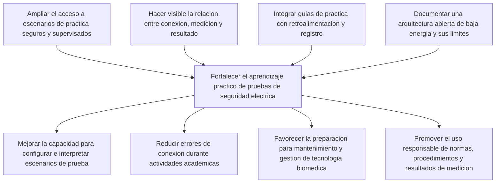

# Arbol de objetivos

## Proposito

El arbol de objetivos transforma el problema preliminar en una situacion deseada. No representa resultados ya obtenidos: las relaciones entre medios, objetivo central y fines se deben validar mediante la indagacion social, el inventario del laboratorio y la revision con docentes.

## Objetivo central

Fortalecer el aprendizaje practico, seguro y comprensible de pruebas seleccionadas de seguridad electrica en equipos electromedicos mediante una plataforma didactica de arquitectura abierta.

## Medios, objetivo y fines

## Relacion con las necesidades

| Medio | Necesidad asociada | Evidencia por obtener | Resultado de diseno esperado |
|---|---|---|---|
| Escenarios seguros y supervisados | N-01: practicar sin exposicion a energia peligrosa. | Riesgos identificados por docentes, personal tecnico e inventario. | Simuladores o cargas protegidas, controles y protocolo de uso. |
| Relacion visible entre conexion y resultado | N-02: comprender secuencia y fundamento. | Dificultades conceptuales y operativas de estudiantes. | Interfaz que muestre escenario, conexion, pasos y explicacion. |
| Guias, retroalimentacion y registro | N-03 y N-05: identificar errores y registrar practicas. | Errores frecuentes y criterios de evaluacion docente. | Lista de verificacion, retroalimentacion y reporte de practica. |
| Arquitectura abierta segura | N-04 y N-08: inspeccionar modulos y comprender limites. | Nivel de conocimientos, documentacion requerida y controles necesarios. | Esquematicos de baja tension, BOM, firmware y advertencias de alcance. |

## Indicadores de logro de la fase de diseno

El arbol se considerara util cuando cada medio se traduzca en uno o mas atributos verificables y cada fin pueda evaluarse sin atribuirle al prototipo una certificacion clinica. Los indicadores preliminares incluyen desempeno en la secuencia de practica, identificacion de configuraciones inseguras, explicacion del resultado, tiempo de preparacion y completitud del registro.
