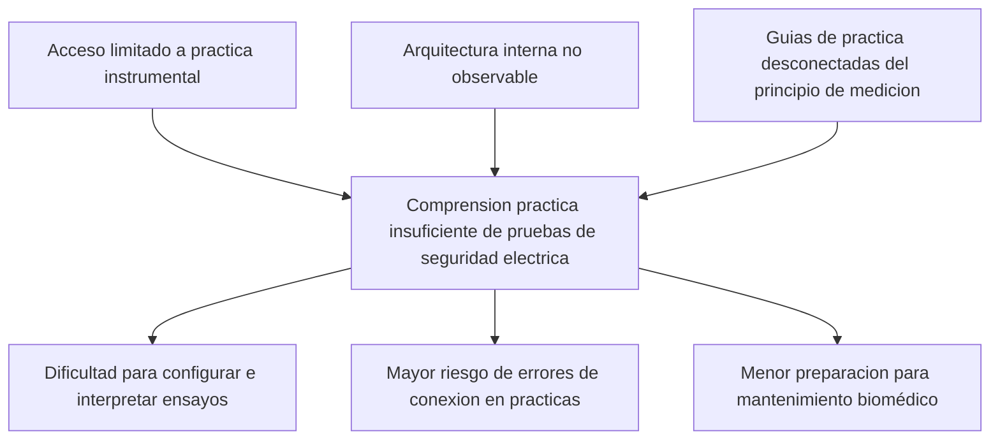
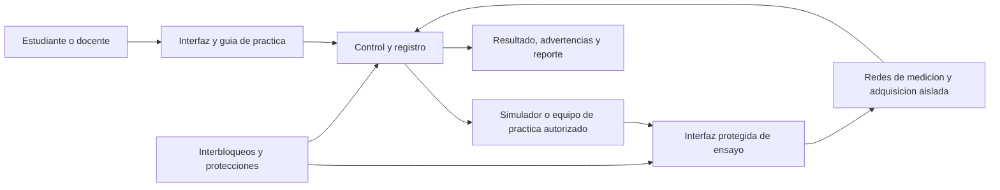

# INFORME DEL PROYECTO DE DISENO BIOMEDICO

## Diseno de un prototipo de analizador de seguridad electrica de arquitectura abierta para el aprendizaje practico de pruebas de seguridad electrica en equipos electromedicos, con referencia a IEC 60601-1 e IEC 62353

**Integrantes:** [Nombres completos y codigos]  
**Programa:** [Programa academico]  
**Asignatura:** Diseno Biomedico I  
**Docente:** [Nombre]  
**Universidad:** [Nombre]  
**Fecha:** [Mes y ano]

> **Alcance del proyecto:** el resultado es un prototipo didactico para laboratorio. No es un producto sanitario ni un instrumento certificado para liberar equipos clinicos al servicio. Sus resultados no se utilizaran para declarar conformidad normativa, tomar decisiones clinicas ni realizar pruebas con pacientes conectados.

# 1. INTRODUCCION

## 1.1 Descripcion del problema

Los equipos electromedicos emplean energia electrica y, de acuerdo con su funcion, pueden tener partes aplicadas al paciente. Esto hace que la seguridad electrica sea relevante para pacientes, operadores y personal tecnico. IEC 60601-1 establece requisitos generales de seguridad basica y desempeno esencial para equipos electromedicos; IEC 62353 aborda pruebas de seguridad previas a la puesta en servicio, durante mantenimiento, despues de reparacion y de forma recurrente (International Electrotechnical Commission [IEC], 2020, 2014).

En la formacion practica de ingenieria biomedica, el aprendizaje de estas pruebas puede depender de analizadores comerciales de arquitectura cerrada. Aunque son apropiados para el entorno profesional, su costo, baja disponibilidad o automatizacion pueden limitar que el estudiante observe la relacion entre el principio electrico, la configuracion del ensayo y el resultado obtenido. En consecuencia, se puede aprender la secuencia de operacion de un equipo sin comprender plenamente las condiciones de prueba, los riesgos de conexion y la interpretacion responsable de una medicion.

El problema de diseno se formula como: **¿Como disenar un prototipo de analizador de seguridad electrica, de arquitectura abierta y uso didactico, que permita a estudiantes practicar de manera segura pruebas seleccionadas de seguridad electrica en equipos electromedicos, tomando como referencia IEC 60601-1 e IEC 62353?**

Las causas y el impacto deben validarse con la indagacion realizada:

| Aspecto | Informacion que debe incorporarse con evidencia |
|---|---|
| Causas | Disponibilidad de instrumentos, horas de practica, dificultades de interpretacion, acceso a manuales y necesidad de visualizar la arquitectura. |
| Efectos | Desempeno en practicas, errores de conexion, aprendizaje memoristico o dependencia de un unico instrumento. |
| Poblacion | Numero y perfil de estudiantes, docentes y personal tecnico participantes. |
| Contexto | Inventario de laboratorio, normas de uso, asignaturas involucradas, presupuesto y restricciones de espacio. |
| Sustento | Resultados anonimizados de encuestas/entrevistas, fotografias autorizadas del entorno, inventario y fuentes bibliograficas. |

**Arbol de problemas propuesto**

El arbol es una hipotesis inicial y debe ajustarse cuando se analicen las entrevistas y encuestas. No se deben incluir cifras o conclusiones que no provengan de los datos recolectados.

## 1.2 Objetivos del proyecto

### Objetivo general

Disenar un prototipo de analizador de seguridad electrica de arquitectura abierta para apoyar el aprendizaje practico de pruebas seleccionadas en equipos electromedicos, con referencia a IEC 60601-1 e IEC 62353.

### Objetivos especificos

1. Caracterizar las necesidades, conocimientos previos y condiciones de uso de estudiantes, docentes y personal tecnico mediante entrevistas, encuesta e inventario del entorno de practica.
2. Establecer requisitos funcionales, de seguridad, usabilidad y trazabilidad del prototipo a partir de la indagacion, revision documental y analisis de soluciones existentes.
3. Generar y seleccionar una arquitectura abierta que permita demostrar de forma segura las funciones de medicion escogidas y registrar los resultados de practica.
4. Construir y evaluar un prototipo contra los requisitos priorizados, empleando simuladores o cargas de practica y un protocolo de pruebas.

## 1.3 Justificacion

El proyecto propone una herramienta de aprendizaje que relaciona seguridad electrica, arquitectura de medicion y procedimiento de prueba. Su aporte no es reemplazar un analizador certificado, sino permitir que el estudiante inspeccione sus bloques funcionales, configure escenarios controlados y contraste resultados con un procedimiento documentado.

En el plano academico, integra electronica, instrumentacion, gestion del riesgo y normativa de equipos electromedicos. En el plano practico, puede apoyar la comprension de conceptos como continuidad del conductor de proteccion, aislamiento y corrientes de fuga. En el plano economico, una arquitectura modular y documentada puede facilitar el mantenimiento y la replicabilidad en el laboratorio. Las afirmaciones sobre costo, cobertura o impacto deben respaldarse posteriormente con cotizaciones, resultados de indagacion y evaluacion del prototipo.

## 1.4 Antecedentes y estado del arte

IEC 60601-1 es el referente general de seguridad basica y desempeno esencial de equipos electromedicos. IEC 62353 se enfoca en pruebas recurrentes y posteriores a reparacion. Por lo tanto, sus propositos no son intercambiables: la primera norma sirve de marco para la seguridad del equipo y la segunda para actividades de prueba durante su vida util (IEC, 2020, 2014).

Los analizadores comerciales integran, con distintos niveles de automatizacion, funciones tales como pruebas de continuidad de tierra de proteccion, aislamiento y corrientes de fuga. Fluke Biomedical ESA615 y Rigel 288+ son referentes funcionales y de seguridad; Pronk Safe-T Sim aporta una referencia de simulacion. No son competidores equivalentes del prototipo didactico: el benchmark compara pruebas, interfaces, accesorios, protecciones, uso previsto, exactitud declarada y costo cotizado, mientras que el prototipo prioriza comprensión, documentacion y escenarios seguros. El análisis completo está en [Estado del arte](../02_DHF_Proceso_Diseno/Fase_1_Investigacion/REFERENTES%20CONCEPTUALES%20Y%20CONTEXTUALES/Estado%20del%20arte.md).

## 1.5 Marco teorico y normativo

### Equipo electromedico y seguridad electrica

El marco teorico debe explicar el riesgo asociado a la energia electrica, las partes conductivas accesibles, la conexion a tierra de proteccion y las partes aplicadas al paciente. La seguridad electrica busca limitar la exposicion a corrientes peligrosas y preservar condiciones seguras en operacion normal y ante condiciones de falla definidas.

| Concepto | Relacion con el proyecto |
|---|---|
| Conexion a tierra de proteccion | Permite explicar el camino electrico entre el terminal de proteccion y partes conductivas accesibles, en montajes controlados. |
| Corriente de fuga | Permite estudiar corrientes no intencionales por tierra, envolvente o parte aplicada, segun la configuracion de ensayo. |
| Partes aplicadas B, BF y CF | Permite contextualizar diferentes relaciones de contacto con el paciente. No se debe clasificar un equipo sin consultar su documentacion. |
| Condicion normal y falla unica | Relaciona la configuracion de ensayo con escenarios definidos por el metodo de referencia. |
| Red de medicion | Explica que la lectura depende de red, rango, proteccion y metodo de medicion. |
| Trazabilidad metrologica | Distingue una lectura educativa de una medicion con calibracion e incertidumbre apta para uso profesional. |

### IEC 60601-1 e IEC 62353

IEC 60601-1 funciona en este proyecto como marco conceptual para seguridad basica, desempeno esencial y analisis de riesgo. IEC 62353 orienta procedimientos de aprendizaje para pruebas recurrentes y posteriores a reparacion. Se debe citar la edicion institucionalmente licenciada y evitar reproducir tablas, limites o figuras extensas de las normas, protegidas por derechos de autor.

### Arquitectura abierta y gestion del riesgo

La arquitectura abierta implica documentar interfaces, esquematicos, firmware, lista de materiales, protocolo de pruebas y criterios de uso. No implica exponer al usuario a partes energizadas ni permitir modificaciones sin control. Las interfaces que involucren red electrica requieren aislamiento, barreras, protecciones, enclavamientos y acceso restringido. La matriz de riesgos debe incluir contacto con tension, energia residual, conexion incorrecta, falla de aislamiento, lectura erronea, uso clinico indebido y modificaciones no autorizadas.

### Educacion practica y diseno centrado en usuarios

El prototipo se plantea como una actividad de aprendizaje activo: el estudiante predice, configura, ejecuta en un escenario seguro, registra y explica el resultado. La literatura reciente sobre aprendizaje basado en proyectos, retos y bioinstrumentacion respalda evaluar desempeño observable, retroalimentación y reflexión, no solo satisfacción. La indagación con estudiantes, docentes y personal técnico permitirá adaptar la experiencia al contexto real de laboratorio. El desarrollo completo, incluido el marco de arquitectura abierta, metrología, educación y diseño centrado en usuarios, se encuentra en [Marco teórico](../02_DHF_Proceso_Diseno/Fase_1_Investigacion/REFERENTES%20CONCEPTUALES%20Y%20CONTEXTUALES/Marco%20teorico.md).

# 2. LISTA DE NECESIDADES

La lista se completa a partir de entrevistas, encuestas, observacion e inventario. Conservar tanto los instrumentos aplicados como una base anonima de las respuestas.

## 2.1 Proceso de indagacion

El protocolo detallado, instrumentos, medidas éticas, criterios de análisis y matriz de trazabilidad están en [Indagación social](../02_DHF_Proceso_Diseno/Fase_1_Investigacion/INDAGACION%20SOCIAL/indagacion%20social.md). Los resultados deben completarse con datos reales y anonimizados; no se declararán necesidades validadas antes de aplicar los instrumentos.

**Entrevistas a docentes o personal tecnico**

1. ¿Que pruebas considera fundamentales para que un estudiante comprenda antes de usar un analizador profesional?
2. ¿Que errores de conexion, interpretacion o seguridad se presentan con mayor frecuencia?
3. ¿Que restricciones de equipos, tiempo, presupuesto o espacio condicionan las practicas?
4. ¿Que informacion debe ser visible durante una practica para comprender un resultado?
5. ¿Que condiciones harian inseguro o inaceptable un prototipo didactico?
6. ¿Que evidencia demostraria que la herramienta mejora el aprendizaje?

**Encuesta a estudiantes** (escala 1: totalmente en desacuerdo a 5: totalmente de acuerdo)

1. Comprendo la diferencia entre una prueba de continuidad de tierra y una prueba de corriente de fuga.
2. Puedo identificar los riesgos antes de conectar un equipo a un analizador.
3. He tenido suficiente tiempo de practica con instrumentos de seguridad electrica.
4. La interfaz disponible me permite comprender como se obtiene cada medicion.
5. Me resultaria util observar los bloques funcionales y la secuencia de una prueba.
6. Necesito retroalimentacion inmediata sobre conexiones o configuraciones incorrectas.
7. Considero importante registrar el procedimiento y resultado de cada practica.
8. ¿Que aspecto le resulta mas dificil al realizar o interpretar una prueba?

## 2.2 Necesidades priorizadas

| Codigo | Necesidad expresada sin imponer una solucion | Fuente | Importancia | Evidencia |
|---|---|---|---:|---|
| N-01 | El usuario necesita practicar sin exposicion a partes peligrosas. | Por completar | Por completar | Por completar |
| N-02 | El usuario necesita comprender la secuencia y el principio de cada prueba. | Por completar | Por completar | Por completar |
| N-03 | El usuario necesita visualizar una arquitectura documentada y modificable de forma segura. | Por completar | Por completar | Por completar |
| N-04 | El usuario necesita registrar una practica reproducible. | Por completar | Por completar | Por completar |
| N-05 | El usuario necesita preparar el sistema con recursos y tiempo compatibles con el laboratorio. | Por completar | Por completar | Por completar |

# 3. CLASIFICACION DE LOS ATRIBUTOS DE DISENO

| Necesidad | Atributo o metrica tecnica | Unidad | Tipo | Target preliminar | Metodo de verificacion |
|---|---|---|---|---|---|
| N-01 | Barreras, aislamiento y enclavamientos implementados | Cumple/no cumple | Restriccion | Por definir tras analisis de riesgo | Inspeccion y prueba de seguridad |
| N-02 | Cobertura de pruebas didacticas seleccionadas | Numero | Requerimiento | Por definir con indagacion | Prueba de escenario |
| N-03 | Documentacion publica de modulos e interfaces | Porcentaje | Requerimiento | Por definir | Revision documental |
| N-04 | Campos de trazabilidad almacenados por practica | Numero | Requerimiento | Por definir | Prueba de registro |
| N-05 | Tiempo de preparacion | Minutos | Requerimiento | Por definir | Cronometraje |
| N-05 | Costo total de materiales | Moneda local | Restriccion | Por definir con cotizaciones | Presupuesto |

La Casa de la Calidad se debe completar con las importancias reales de la tabla de necesidades y con relaciones justificadas. El archivo `CASA DE LA CALIDAD EXCEL/CASA DE CALIDAD.xlsx` es solo una referencia de formato: no se deben reutilizar sus necesidades, pesos ni atributos porque pertenecen a otro proyecto.

## 3.1 Evaluacion de productos referentes

| Criterio | Referente 1 | Referente 2 | Referente 3 | Producto disimil | Prototipo propuesto |
|---|---|---|---|---|---|
| Pruebas disponibles | Por documentar | Por documentar | Por documentar | Por documentar | Por definir |
| Arquitectura visible | Por documentar | Por documentar | Por documentar | Por documentar | Objetivo: documentada |
| Registro de resultados | Por documentar | Por documentar | Por documentar | Por documentar | Por definir |
| Protecciones | Por documentar | Por documentar | Por documentar | Por documentar | Por definir |
| Costo | Por cotizar | Por cotizar | Por cotizar | Por cotizar | Por presupuestar |

# 4. GENERACION DE CONCEPTOS

Se debe presentar caja negra, caja transparente, arbol funcional y matriz morfologica. La arquitectura inicial por explorar es:

Las alternativas deben diferir de forma real:

| Alternativa | Descripcion | Ventaja a evaluar | Riesgo a evaluar |
|---|---|---|---|
| A | Banco de simuladores de fallos de baja energia. | Mayor control y seguridad. | Menor cercania a un ensayo real. |
| B | Adaptador de demostracion supervisado para equipo autorizado. | Mayor fidelidad de practica. | Mayor complejidad de seguridad. |
| C | Plataforma hibrida de simulacion y medicion de parametros seguros. | Balance entre visualizacion y practica. | Integracion mas compleja. |

# 5. SELECCION DE CONCEPTOS

La seleccion se realiza primero con matriz de tamizado y luego con matriz ponderada. Los criterios deben provenir de la Casa de la Calidad: seguridad, valor pedagogico, viabilidad tecnica, costo, mantenibilidad, apertura documental y facilidad de verificacion. No se debe elegir una alternativa antes de completar el analisis de riesgo y las ponderaciones.

| Criterio | Peso | Alternativa A | Alternativa B | Alternativa C |
|---|---:|---:|---:|---:|
| Seguridad | Por definir | Por evaluar | Por evaluar | Por evaluar |
| Valor pedagogico | Por definir | Por evaluar | Por evaluar | Por evaluar |
| Viabilidad | Por definir | Por evaluar | Por evaluar | Por evaluar |
| Costo | Por definir | Por evaluar | Por evaluar | Por evaluar |
| Arquitectura abierta | Por definir | Por evaluar | Por evaluar | Por evaluar |

# 6. ARQUITECTURA DE PRODUCTO

El concepto seleccionado se descompone en los siguientes modulos: interfaz de usuario, control y registro, interfaz de ensayo protegida, simulador o carga de practica, redes de medicion, adquisicion aislada, alimentacion y protecciones. Se deben elaborar un diagrama de bloques, matriz DSM y matriz FCM, diferenciando interacciones fundamentales e incidentales.

La entrega de esta fase debe incluir modelo CAD preliminar, disposicion de los modulos, conectores, rutas de energia y zonas de acceso restringido.

# 7. DISENO DETALLADO

Esta fase debe incluir: esquematicos, diseno PCB si aplica, CAD de carcasa, lista de materiales, firmware, calculos, analisis de riesgo, especificaciones de componentes, protocolo de ensamblaje y protocolo de verificacion. Cada requisito de la seccion 3 debe tener al menos un metodo de verificacion.

No se conectara el prototipo a pacientes. Las pruebas iniciales se realizaran con simuladores, cargas o equipos autorizados y bajo supervision.

# 8. FACTORES ASOCIADOS AL PROCESO DE DISENO

| Factor | Analisis requerido |
|---|---|
| Riesgo | Matriz de peligros, controles, riesgo residual, etiquetado, procedimientos y capacitacion. |
| Economico | Presupuesto, cotizaciones, costo de mantenimiento, repuestos y comparacion con alternativas. |
| Ambiental | Consumo de energia, seleccion de materiales, reparabilidad, manejo de residuos electronicos y fin de vida. |
| Social | Accesibilidad de aprendizaje, disponibilidad de practica, formacion responsable y efectos para estudiantes/docentes. |

# 9. CONCLUSIONES

Las conclusiones se redactaran al final y responderan los objetivos con evidencia. Deben diferenciar entre: requisitos cumplidos, limitaciones del prototipo, resultados de validacion didactica y trabajo futuro. No se debe declarar certificacion IEC sin una evaluacion formal y trazable fuera del alcance de este proyecto.

# REFERENCIAS

La bibliografía académica y normativa consolidada está en [Bibliografía consolidada](../02_DHF_Proceso_Diseno/Fase_1_Investigacion/REFERENTES%20CONCEPTUALES%20Y%20CONTEXTUALES/Bibliografia%20consolidada.md#referencias). Al consolidar la versión final para entrega, esta lista debe incorporarse íntegramente a esta sección y verificarse contra las citas realmente utilizadas.
